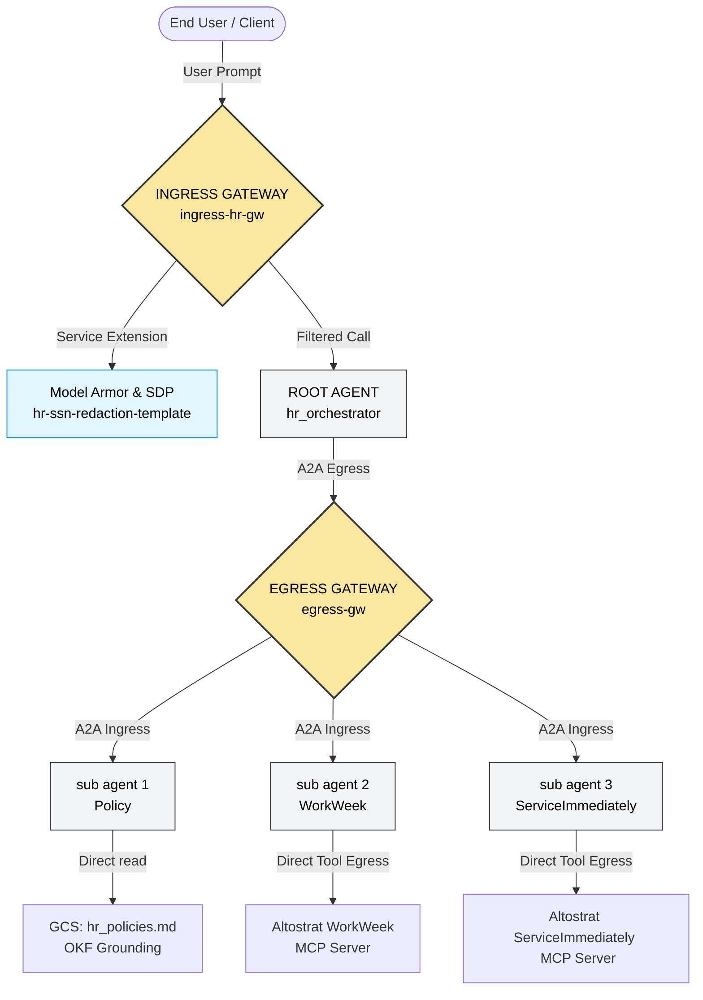

# Globex HR Agent Suite: Deployment Plan (Updated)

This document outlines the detailed step-by-step deployment plan for migrating the local 4-Agent HR Concierge Orchestration suite to Google Cloud Vertex AI Agent Runtime. It incorporates two managed Google Cloud **Agent Gateways** in the `asia-southeast1` (Singapore) region:
1.  **Client-to-Agent (ingress) Gateway** (`ingress-hr-gw`) secured by **Model Armor** and SDP content filters to governance-inspect client requests.
2.  **Agent-to-Anywhere (egress) Gateway** (`egress-gw`) bound to Identity-Aware Proxy to secure and authorize inter-agent A2A calls.

## Target Architecture Summary



---

## Phase A: Pre-requisites

### [x] Step A.1: Enable Google Cloud APIs (Done)
Run the following command to enable the necessary APIs in your GCP project (`gm-agentic`):
```bash
gcloud services enable \
    aiplatform.googleapis.com \
    agentregistry.googleapis.com \
    networkservices.googleapis.com \
    networksecurity.googleapis.com \
    compute.googleapis.com \
    secretmanager.googleapis.com \
    cloudtrace.googleapis.com \
    monitoring.googleapis.com \
    --project=gm-agentic
```

### [x] Step A.2: Configure Service Accounts & IAM Policies (Done)
Create a dedicated service account for running the reasoning engines:
1.  **Agent Execution Service Account**: `hr-agents-runner@gm-agentic.iam.gserviceaccount.com`
    *   Roles needed:
        *   `roles/aiplatform.user`
        *   `roles/logging.logWriter`
        *   `roles/monitoring.metricWriter`
        *   `roles/cloudtrace.agent`

---

## Phase B: Provision Managed Agent Gateways (Egress and Ingress)

Since the Agent Gateway is a Google-managed infrastructure service, we do not package or deploy container images. We provision the gateway resource directly via the `networkservices` API.

### [x] Step B.1: Create the Agent-to-Anywhere (Egress) Gateway (`egress-gw`) (Done)
This gateway governs all outgoing communications (inter-agent A2A calls and tool/API invocations):
```bash
gcloud alpha network-services agent-gateways create egress-gw \
    --location=asia-southeast1 \
    --governed-access-path=AGENT_TO_ANYWHERE \
    --project=gm-agentic
```

### [x] Step B.2: Configure Identity-Aware Proxy (IAP) Service Extension (Done)
To enforce token verification and evaluate IAM policies for Agent-to-Agent (A2A) queries, configure the IAP authorization extension:
*   Create `iap-request-authz-extension.yaml`:
    ```yaml
    name: iap-authz-ext
    service: iap.googleapis.com
    failOpen: true
    timeout: 1s
    metadata:
      iamEnforcementMode: "ENFORCE"
      iapPolicyVersion: "V1"
    ```
*   Import the authorization extension:
    ```bash
    gcloud beta service-extensions authz-extensions import iap-authz-ext \
        --source=iap-request-authz-extension.yaml \
        --location=asia-southeast1 \
        --project=gm-agentic
    ```

### [x] Step B.3: Bind the Authorization Policy to the Egress Gateway (Done)
Attach the newly created authorization extension to our egress gateway:
*   Create `iap-request-authz-policy.yaml`:
    ```yaml
    name: iap-authz-policy
    target:
      resources:
        - "projects/gm-agentic/locations/asia-southeast1/agentGateways/egress-gw"
    policyProfile: REQUEST_AUTHZ
    action: CUSTOM
    customProvider:
      authzExtension:
        resources:
          - "projects/gm-agentic/locations/asia-southeast1/authzExtensions/iap-authz-ext"
    ```
*   Import the authorization policy:
    ```bash
    gcloud network-security authz-policies import iap-authz-policy \
        --source=iap-request-authz-policy.yaml \
        --location=asia-southeast1 \
        --project=gm-agentic
    ```

### [x] Step B.4: Provision Client-to-Agent (Ingress) Agent Gateway (`ingress-hr-gw`) (Done)
This gateway intercepts all incoming user queries before forwarding them to the Root Orchestrator Reasoning Engine.
*   Create the Ingress Gateway config (`cfg/ingress-hr-gw.yaml`):
    ```yaml
    name: ingress-hr-gw
    protocols:
      - MCP
    googleManaged:
      - governedAccessPath: CLIENT_TO_AGENT
    ```
*   Import the Ingress Gateway:
    ```bash
    gcloud alpha network-services agent-gateways import ingress-hr-gw \
        --source="cfg/ingress-hr-gw.yaml" \
        --location=asia-southeast1 \
        --project=gm-agentic
    ```

### [x] Step B.5: Set Up SDP (Sensitive Data Protection) Templates (Done)
These templates are used by Model Armor to inspect and redact PII in response payloads.
*   Create Inspect Template (`hr-ssn-inspect-template`):
    ```bash
    curl -fsS -X POST "https://dlp.googleapis.com/v2/projects/gm-agentic/locations/asia-southeast1/inspectTemplates" \
      -H "Authorization: Bearer $(gcloud auth application-default print-access-token)" \
      -H "Content-Type: application/json" -H "x-goog-user-project: gm-agentic" \
      -d @- << EOF
    {
      "templateId": "hr-ssn-inspect-template",
      "inspectTemplate": {
        "displayName": "HR SSN Inspect Template",
        "inspectConfig": {
          "infoTypes": [
            { "name": "US_SOCIAL_SECURITY_NUMBER" }
          ],
          "minLikelihood": "LIKELY"
        }
      }
    }
    EOF
    ```
*   Create Deidentify Template (`hr-ssn-redaction-template`):
    ```bash
    curl -fsS -X POST "https://dlp.googleapis.com/v2/projects/gm-agentic/locations/asia-southeast1/deidentifyTemplates" \
      -H "Authorization: Bearer $(gcloud auth application-default print-access-token)" \
      -H "Content-Type: application/json" -H "x-goog-user-project: gm-agentic" \
      -d @- << EOF
    {
      "templateId": "hr-ssn-redaction-template",
      "deidentifyTemplate": {
        "displayName": "HR SSN Redaction Template",
        "deidentifyConfig": {
          "infoTypeTransformations": {
            "transformations": [
              {
                "infoTypes": [
                  { "name": "US_SOCIAL_SECURITY_NUMBER" }
                ],
                "primitiveTransformation": {
                  "replaceWithInfoTypeConfig": {}
                }
              }
            ]
          }
        }
      }
    }
    EOF
    ```
*   Grant SDP permissions to the Model Armor service agent:
    ```bash
    PROJ_NO=$(gcloud projects describe gm-agentic --format="value(projectNumber)")
    
    gcloud projects add-iam-policy-binding gm-agentic \
      --member="serviceAccount:service-${PROJ_NO}@gcp-sa-modelarmor.iam.gserviceaccount.com" \
      --role="roles/dlp.user"
    ```

### [x] Step B.6: Configure Model Armor Guardrail Templates (Done)
Create templates to filter prompt inputs and redact generated output.
*   Override CLI API Endpoint for Model Armor:
    ```bash
    gcloud config set api_endpoint_overrides/modelarmor "https://modelarmor.asia-southeast1.rep.googleapis.com/"
    ```
*   Create Request Filter Template (`ingress-hr-req-template`):
    ```bash
    gcloud beta model-armor templates create ingress-hr-req-template \
      --project=gm-agentic \
      --location=asia-southeast1 \
      --rai-settings-filters='[
        { "filterType": "HATE_SPEECH", "confidenceLevel": "MEDIUM_AND_ABOVE" },
        { "filterType": "HARASSMENT", "confidenceLevel": "MEDIUM_AND_ABOVE" },
        { "filterType": "SEXUALLY_EXPLICIT", "confidenceLevel": "MEDIUM_AND_ABOVE" }
      ]' \
      --pi-and-jailbreak-filter-settings-enforcement=enabled \
      --pi-and-jailbreak-filter-settings-confidence-level=medium-and-above \
      --template-metadata-enforcement-type=INSPECT_AND_BLOCK \
      --malicious-uri-filter-settings-enforcement=enabled \
      --template-metadata-custom-prompt-safety-error-code=799 \
      --template-metadata-custom-prompt-safety-error-message="The request was blocked by the HR Content Filter. Please rephrase and try again." \
      --template-metadata-log-operations
    ```
*   Create Response Filter Template (`ingress-hr-resp-template`):
    ```bash
    gcloud beta model-armor templates create ingress-hr-resp-template \
      --project=gm-agentic \
      --location=asia-southeast1 \
      --rai-settings-filters='[
        { "filterType": "HATE_SPEECH", "confidenceLevel": "MEDIUM_AND_ABOVE" },
        { "filterType": "HARASSMENT", "confidenceLevel": "MEDIUM_AND_ABOVE" },
        { "filterType": "SEXUALLY_EXPLICIT", "confidenceLevel": "MEDIUM_AND_ABOVE" }
      ]' \
      --template-metadata-enforcement-type=INSPECT_AND_BLOCK \
      --malicious-uri-filter-settings-enforcement=enabled \
      --advanced-config-inspect-template=projects/gm-agentic/locations/asia-southeast1/inspectTemplates/hr-ssn-inspect-template \
      --advanced-config-deidentify-template=projects/gm-agentic/locations/asia-southeast1/deidentifyTemplates/hr-ssn-redaction-template \
      --template-metadata-custom-llm-response-safety-error-code=798 \
      --template-metadata-custom-llm-response-safety-error-message="The agent response was blocked by the safety content filter." \
      --template-metadata-log-operations
    ```

### [x] Step B.7: Set Up Service Extension and Authorization Policy (Done)
*   Grant Service Extensions (DEP) service agent permissions:
    ```bash
    gcloud projects add-iam-policy-binding gm-agentic \
      --member="serviceAccount:service-${PROJ_NO}@gcp-sa-dep.iam.gserviceaccount.com" \
      --role="roles/modelarmor.calloutUser"
      
    gcloud projects add-iam-policy-binding gm-agentic \
      --member="serviceAccount:service-${PROJ_NO}@gcp-sa-dep.iam.gserviceaccount.com" \
      --role="roles/serviceusage.serviceUsageConsumer"
      
    gcloud projects add-iam-policy-binding gm-agentic \
      --member="serviceAccount:service-${PROJ_NO}@gcp-sa-dep.iam.gserviceaccount.com" \
      --role="roles/modelarmor.user"
    ```
*   Create Authorization Service Extension (`ingress-hr-ext`):
    Create `cfg/ingress-hr-ext.yaml`:
    ```yaml
    name: ingress-hr-ext
    service: modelarmor.asia-southeast1.rep.googleapis.com
    failOpen: true
    timeout: 5s
    metadata:
      model_armor_settings: '[
        {
          "request_template_id": "projects/gm-agentic/locations/asia-southeast1/templates/ingress-hr-req-template",
          "response_template_id": "projects/gm-agentic/locations/asia-southeast1/templates/ingress-hr-resp-template"
        }
      ]'
    ```
    Import the extension:
    ```bash
    gcloud service-extensions authz-extensions import ingress-hr-ext \
        --source=cfg/ingress-hr-ext.yaml \
        --location=asia-southeast1 \
        --project=gm-agentic
    ```
*   Create Authorization Policy (`ingress-hr-policy`):
    Create `cfg/ingress-hr-policy.yaml`:
    ```yaml
    name: ingress-hr-policy
    target:
      resources:
        - "projects/gm-agentic/locations/asia-southeast1/agentGateways/ingress-hr-gw"
    policyProfile: CONTENT_AUTHZ
    action: CUSTOM
    customProvider:
      authzExtension:
        resources:
          - "projects/gm-agentic/locations/asia-southeast1/authzExtensions/ingress-hr-ext"
    ```
    Import the policy:
    ```bash
    gcloud beta network-security authz-policies import ingress-hr-policy \
        --source=cfg/ingress-hr-policy.yaml \
        --location=asia-southeast1 \
        --project=gm-agentic
    ```

---

## Phase C: Deploying Agents to Agent Runtime (with Gateway Bindings)

Because `agents-cli deploy` is a simplified CLI wrapper that does not expose gateway binding parameters, we will deploy the agents using a Python script (`deploy_agents.py`) which invokes the Vertex AI SDK client directly.

Each agent runs with a SPIFFE-based `AGENT_IDENTITY` and is hooked to the gateway in its deployment spec config.

### Gateway Binding Logic:
To enforce secure routing for inter-agent A2A delegation calls:
*   **Root Orchestrator** (`hr_orchestrator`) must be bound to the egress gateway using `agent_to_anywhere_config` -> `egress-gw` to route outbound calls to sub-agents.
*   **Sub-agents** (`policy_agent`, `workweek_agent`, `service_immediately_agent`) make direct tool calls and do not call other agents. They require **no** gateway bindings (i.e. `agent_gateway_config` is omitted or set to `None`).

### [x] Step C.1: Upload Policy Document to GCS (Open Knowledge Format - OKF) (Done)
Move the OKF document to a Google Cloud Storage bucket so the deployed `policy_agent` can query it in the cloud:
```bash
gsutil mb -l asia-southeast1 gs://hr-policies-gm-agentic
gsutil cp hr_policies.md gs://hr-policies-gm-agentic/hr_policies.md
# Grant read permissions to your runner service account
gsutil iam ch serviceAccount:hr-agents-runner@gm-agentic.iam.gserviceaccount.com:objectViewer gs://hr-policies-gm-agentic
```

### [x] Step C.2: Run the Deployment Script (Done)
We have executed the `deploy_agents.py` Python script to deploy all 4 agents in `asia-southeast1`. The script binds the Root Orchestrator's config to the egress gateway and grants IAM roles to each agent identity principal.
```bash
python3 deploy_agents.py
```

### [x] Step C.3: Verify Agent Code Modifications (for Gateway A2A Routing) (Done)
Verified that all 4 agents are actively running in Vertex AI Agent Runtime with dedicated Agent Identity.

---

## Phase D: Register Sub-Agents and Tools in Agent Registry

For the Egress Gateway to authorize and route outbound calls, the target endpoints must be registered in the Agent Registry.

### [ ] Step D.1: Register Sub-Agents in Agent Registry (A2A Routing)
Retrieve the engine IDs of the deployed sub-agents and register them:
```bash
# Example commands to register the endpoints
gcloud alpha agent-registry endpoints register policy_agent \
    --address="https://asia-southeast1-aiplatform.googleapis.com/v1beta1/projects/gm-agentic/locations/asia-southeast1/reasoningEngines/<POLICY_ENGINE_ID>" \
    --project=gm-agentic

gcloud alpha agent-registry endpoints register workweek_agent \
    --address="https://asia-southeast1-aiplatform.googleapis.com/v1beta1/projects/gm-agentic/locations/asia-southeast1/reasoningEngines/<WORKWEEK_ENGINE_ID>" \
    --project=gm-agentic

gcloud alpha agent-registry endpoints register service_immediately_agent \
    --address="https://asia-southeast1-aiplatform.googleapis.com/v1beta1/projects/gm-agentic/locations/asia-southeast1/reasoningEngines/<SERVICE_IMMEDIATELY_ENGINE_ID>" \
    --project=gm-agentic
```

---

## Phase E: Model Context Protocol (MCP) Integration

Rather than invoking standard mock databases, sub-agent #2 (WorkWeek) and sub-agent #3 (ServiceImmediately) connect directly to the Altostrat Mock SaaS platform's stateless Streamable HTTP MCP servers.

### [ ] Step E.1: Configure Local Environment Variables
Before running the deployment script, retrieve your Personal Access Token (PAT) from `https://mock-saas.aishprabhat.demo.altostrat.com/` and export it in your shell:
```bash
export MOCK_SAAS_MCP_TOKEN="mcp_your_token_here"
```

---

## Phase F: Observability & Monitoring

Since all traffic (A2A and tool invocations) flows through the managed Egress Gateway, we get comprehensive telemetry out-of-the-box.

1.  **Cloud Trace**: View spans representing user query -> Root Agent -> Egress Gateway -> Sub-agent -> Egress Gateway -> Database Tool.
2.  **Monarch / Automon**: Monitor latency and routing error rates at the gateway layer.
3.  **Structured Request Logs**: Inspect logs generated by the gateways in Cloud Logging for compliance auditing.

---

## Phase G: Publish to Gemini Enterprise (@hr_orchestrator Discoverability)

After deploying `hr_orchestrator` to Agent Runtime in `asia-southeast1`, register it with your enterprise Gemini Enterprise application so end users can discover and invoke the agent via `@hr_orchestrator` / `@HR Concierge`:

### [ ] Step G.1: Register Agent with Gemini Enterprise App
```bash
agents-cli publish gemini-enterprise \
  --display-name="HR Concierge" \
  --description="Globex HR Concierge: Answers HR policy questions, manages WorkWeek leave balances & time-off, and submits ServiceImmediately IT and facilities tickets."
```
*(This automatically links the deployed Vertex AI Reasoning Engine endpoint to Gemini Enterprise with ADK streaming mode and user-identity propagation).*

